<link href="https://cdn.jsdelivr.net/npm/bootstrap@5.3.0/dist/css/bootstrap.min.css" rel="stylesheet" integrity="sha384-9ndCyUaIbzAi2FUVXJi0CjmCapSmO7SnpJef0486qhLnuZ2cdeRhO02iuK6FUUVM" crossorigin="anonymous" />

<h1>🙋‍♂️ Olá! Eu sou von Schappler!</h1>

E esses são dados gerais sobre esta conta no Github:

[^1]
[^2]

### Patrocínio e patrocinadores

Pessoal

- Sou uma pessoa diagnosticada dentro do [Espectro autista](https://pt.wikipedia.org/wiki/Transtornos_do_espectro_autista).
- Gosto de aprender coisas novas, principalmente quando as aprendo por conta própria, ou com o mínimo de ajuda.
- Sou uma pessoa muito curiosa e PERFECCIONISTA.
- Tenho extremas dificuldades em me socializar e em trabalhar em grupo (principalmente em grupos grandes)
- Me distraio facilmente com estímulos externos e a distração pode causar alterações muito drásticas de humor.
- A música que estou ouvindo nesse momento é:

  Se não estiver mostrando nenhuma música, é por que não estou programando:

- Tenho conhecimento nas seguintes linguagens/libs/frameworks de programação:

- Estou preparando cursos para publicar na Udemy
- Hobbies (em ordem de preferência):
  - Games
  - Programar
  - Aprender novas coisas
  - Filmes

---

Profissional

- Possuo formação de nível superior em Física
- Trabalhei por anos como professor em instituições educacionais
- Trabalhei por anos com Processamento de dados Aerogeofísicos
- Atualmente trabalho por conta própria, em pequenos projetos:
  - Desenvolvendo scripts em Python para uso com o chatbot da Streamlabs
  - Desenvolvendo pequenos projetos gráficos para empresas locais (arte para material impresso)
  - Fazendo livestreams na plataforma Twitch
  - Produzindo conteúdo para a plataforma YouTube
  - Iniciando minha carreira de instrutor na Udemy

Para saber um pouco mais sobre o profissional von Schappler, visite:

<h4>Estatísticas de minha página pessoal</h4>

---

Estatísticas Git:

<h4>1. Atividade geral:</h4>

<h4>2. Consquistas:</h4>

<h4>3. Hábitos de código:

<h4>4. Estrelas:

<h4>5. Interações:</h4>

Estatísticas geradas com auxilio do plugin [@lowlighter/metrics](https://github.com/lowlighter/metrics) [^3]

[^1]: Estatísticas de visitas, em relação ao repositório principal, [code-with-von.github.io](https://github.com/code-with-von/code-with-von.github.io)
[^2]: A contagem de repositórios não abrange os repositórios privados.
[^3]: Alguns dos dados estatísticos são atualizados a cada 4 horas
